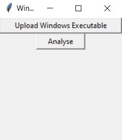
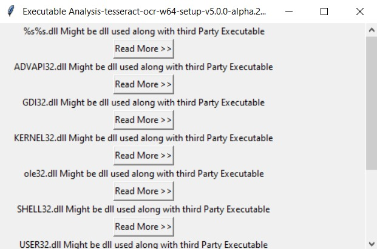
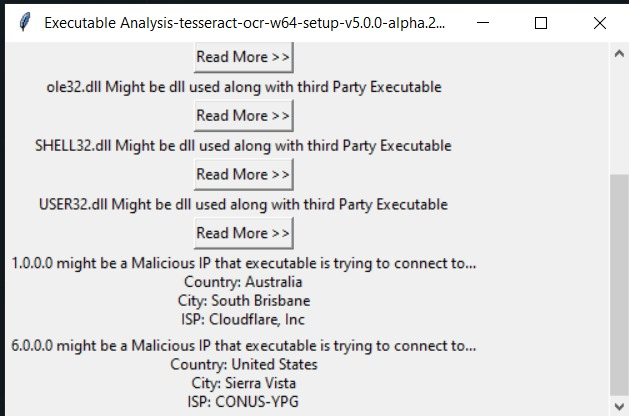

# **QuickSMA** 
#### *static malware analysis*  
   
</br>

<p align="center">
  
</p>

## Table of Contents
- [**QuickSMA**](#quicktoll)
      - [*static malware analysis*](#an-autotmatice-toll-system)
  - [Table of Contents](#table-of-contents)
  - [demo](#demo)
  - [About](#about)
  - [Installation Prerequisites](#installation-prerequisites)
  - [How to Run this Project](#how-to-run-this-project)
  - [Contributors](#contributors)


## demo
[Click Here to See the PPT](https://drive.google.com/file/d/1jW2ijnGPyzz21Du5PvrWpJDr2dBdprRz/view?usp=sharing)

## About
Malware, short for “malicious software,” refers to any intrusive software developed by cybercriminals (often called “hackers”) to steal data and damage or destroy computers and computer systems. Examples of common malware include viruses, worms, Trojan viruses, spyware, adware, and ransomware.

Malware can destroy data, damage your computer, cause your computer to damage other computers, steal information, or cause other harm to property and even life in the case of a system which is in control of some equipment or machinery.

QuickSMA is an implementation of static malware analysis.

**Static malware analysis** involves examining any given malware sample without actually running or executing the code. This is usually done by determining the signature of the malware binary; the signature is a unique identification for the binary file. 

Basic Static analysis involves techniques such as Analysing raw strings in the executables that might
include some malicious IP addresses , pieces of malicious codes, definite patterns of code, DLL’s imports, API calls etc. 

Some DLL imports are specific to some specific type of malware.
eg : “winsock.DLL” is a DLL which provides functions which help a program(malware) to connect to any
remote host via socket.
Therefore, presence of these types of DLL’s in strings can be quite handy in detecting or analysing
malicious executables.

The project uses the algorithm mentioned below :

- Ask the client to upload the executable at GUI provided.
- Extract all strings from executable and store them in temp.txt file.
- Extract all DLL imports and IP addresses using REGEX module and temp.txt file is deleted from client’
system.
- Then using web-scrapping brief information about DLL imports and url links for further reading are
provided on GUI.

</br>
</br>

1. First it asks the user to upload the executable.

    
    <br>

2. Then it extracts all DLL imports and IP addresses and shows them to the user.

    
    <br>

    
    <br>

3. You can click on 'read more' to read more about the respective dll import.

    
    <br>
</br>


## Installation Prerequisites
- python
>To Download python  [Go to the python Download Website](https://www.python.org/downloads/).


## How to Run this Project
1. Clone this Repo to your Local Machine.
2. Open The Terminal/CMD in the rootfolder .
3. Type ```python TOC_malware.py' ```to run the project.
4. You will be asked to upload an executable , select an executable and open it.  
6. Click on Analyse and you will be able to see all the dll imports and IP addresses.
7. Click on 'Read more' to read more about the respective dll import.


## Contributors
[Nitish Kumar](https://github.com/Nitish9711)

[Naveen Kumar](https://github.com/NaveenKumar519)

